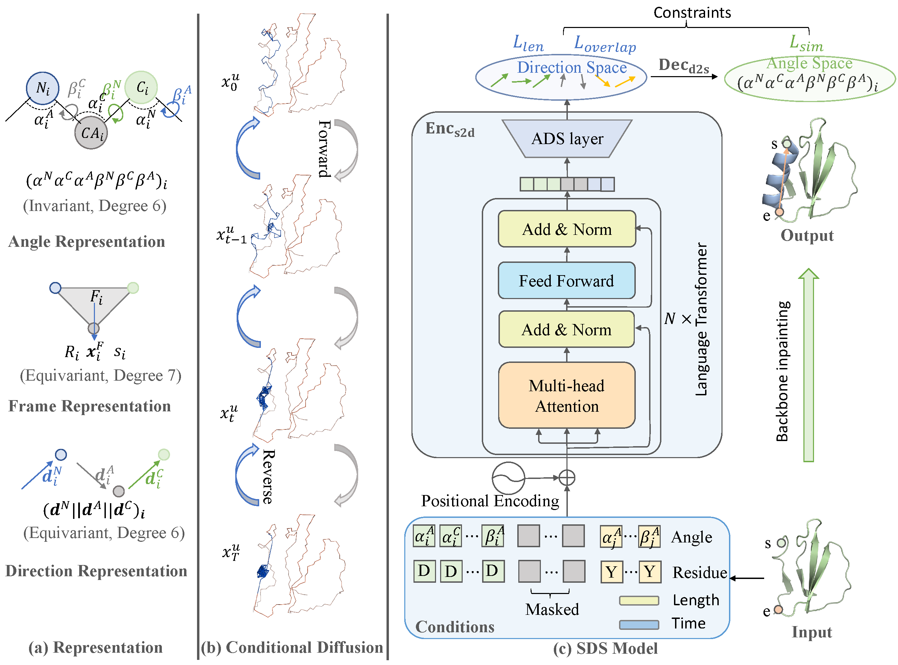

## Introduction
Have you ever been troubled by the complexity and computational cost of SE(3) protein structure modeling and been amazed by the simplicity and power of sequence modeling? Recent work has shown promise in simplifying protein structures as sequences of protein angles; therefore, sequence transformers could be used for unconstrained protein backbone generation. Unfortunately, such simplification is unsuitable for the constrained protein inpainting problem, where the model needs to recover masked structures conditioned on unmasked ones, since the lack of geometric constraints is more likely to produce irrational protein structures. To overcome this dilemma, we suggest inserting a hidden atomic direction space (**ADS**)  upon the sequence model, converting invariant backbone angles into equivariant direction vectors and preserving the simplicity, called Seq2Direct encoder ($\text{Enc}_{s2d}$). Geometric constraints could be efficiently imposed on the newly introduced direction space. A Direct2Seq decoder ($\text{Dec}_{d2s}$) with mathematical guarantees is also introduced to develop a **SDS** ($\text{Enc}_{s2d}$+$\text{Dec}_{d2s}$) model. We apply the SDS model as the denoising neural network during the conditional diffusion process, resulting in a constrained generative model--**DiffSDS**. Extensive experiments show that the plug-and-play ADS could transform the sequence transformer into a strong structural model without loss of simplicity. More importantly,  DiffSDS outperforms previous strong baselines on the task of protein backbone inpainting.

<p align="center">
  
</p>

## Dataset preperation
1. download dataset
    ```
    cd data
    wget -P cath ftp://orengoftp.biochem.ucl.ac.uk/cath/releases/latest-release/non-redundant-data-sets/cath-dataset-nonredundant-S40.pdb.tgz

    cd cath
    tar -xzf cath-dataset-nonredundant-S40.pdb.tgz
    ```
2. split data
    ```
    cd data
    python datasplit.py
    ```

## Train the model
- Debug: 

    Firstly, enter the following commands:
    ```
    CUDA_VISIBLE_DEVICES="0" python -m debugpy --listen 5698 --wait-for-client -m torch.distributed.launch --nproc_per_node 1 main.py
    ```
    then, use VSCode to debug the `main.py`.

- Run:

    ```
    CUDA_VISIBLE_DEVICES="0,1,2,3,4,5,6,7" python -m torch.distributed.launch --nproc_per_node 8 main.py --ex_name DiffSDS --method DiffSDS
    ```

- Sampling:
    ```
    sh sampling.sh
    ```


## Citation

If you are interested in our repository and our paper, please cite the following paper:

```
@article{gao2023diffsds,
  title={DiffSDS: A language diffusion model for protein backbone inpainting under geometric conditions and constraints},
  author={Gao, Zhangyang and Tan, Cheng and Li, Stan Z},
  journal={arXiv preprint arXiv:2301.09642},
  year={2023}
}
```

## Feedback
If you have any issue about this work, please feel free to contact me by email: 
* Zhangyang Gao: gaozhangyang@westlake.edu.cn